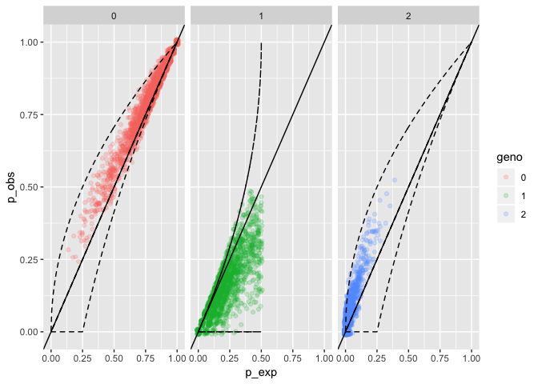
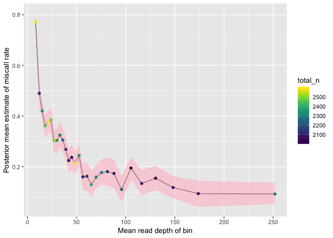

whoa --- Where's my Heterozygotes? Observations on genotyping Accuracy
======================================================================
================
06 September, 2018

-   [A quick run](#a-quick-run)
    -   [Packages](#packages)
    -   [Lobster data](#lobster-data)
    -   [Make a quick genotype frequency scatter plot](#make-a-quick-genotype-frequency-scatter-plot)
    -   [Now infer an overall heterozygote miscall rate.](#now-infer-an-overall-heterozygote-miscall-rate.)
    -   [Now infer a miscall rate for read depth bins](#now-infer-a-miscall-rate-for-read-depth-bins)

<!-- README.md is generated from README.Rmd. Please edit that file -->
This is a small, lightweight package that lets users investigate the distribution of genotypes in GBS data where they expect (by and large) Hardy-Weinberg equilibrium, in order to assess rates of genotyping errors and the dependence of those rates on read depth.

The name comes from the bolded letters in this sentence:

**W**here's my **H**eterozygotes at? **O**bservations on genotyping **A**ccuracy.

It also fits well with my reaction when I started investigating heterozygote miscall rates (rates at which true heterozygotes are incorrectly called as homozygotes) in some RAD-seq data sets---My eyes bugged out and I said, "Whoa!"

The package comes with a small bit of data from lobster to play with. The rest of this document shows a quick run through a few of the functions to do an analysis of a data set.

A quick run
-----------

### Packages

``` r
# load up the package:
library(whoa)
```

### Lobster data

Read about the lobster data here. Execute this if you want:

``` r
help("lobster_buz_2000")
```

The main thing to know is that it is a vcfR object. You can make such an object yourself by reading in a VCF file using `vcfR::read.vcfR()`.

### Make a quick genotype frequency scatter plot

``` r
# first get compute expected and observed genotype frequencies
gfreqs <- exp_and_obs_geno_freqs(lobster_buz_2000)

# then plot those.  Set max_plot_loci so that all 2000
# loci will be plotted
geno_freqs_scatter(gfreqs, max_plot_loci = 2000)
```



### Now infer an overall heterozygote miscall rate.

If we want to estimate the het miscall rate (over all read depth bins) we just set the minimum bin size to a very large value so it make just one bin:

``` r
overall <- infer_m(lobster_buz_2000, minBin = 1e15)
#> Preparing data structures for MCMC
#> Running MCMC
#> Tidying output
```

Now look at that:

``` r
overall$m_posteriors
#> # A tibble: 1 x 6
#>     bin  mean  lo95  hi95 total_n mean_dp
#>   <int> <dbl> <dbl> <dbl>   <int>   <dbl>
#> 1     1 0.256 0.245 0.266   65291    65.9
```

Wow! (Or should we say "WHOA!") A het miscall rate of around 25%.

### Now infer a miscall rate for read depth bins

See the total\_n above is about 65,000. That means 65,000 genotypes. (2000 loci typed at 36 individuals, with some missing data).
We will bin those up so that there are at least 2000 genotypes in each bin and then estimate the het miscall rate for each read depth bin.

``` r
binned <- infer_m(lobster_buz_2000, minBin = 2000)
#> Preparing data structures for MCMC
#> Running MCMC
#> Tidying output
```

And then we can plot the posterior mean and CIs for each read depth bin.

``` r
posteriors_plot(binned$m_posteriors)
```



Again, WHOA! The het miscall rate at low read depths is super high!
